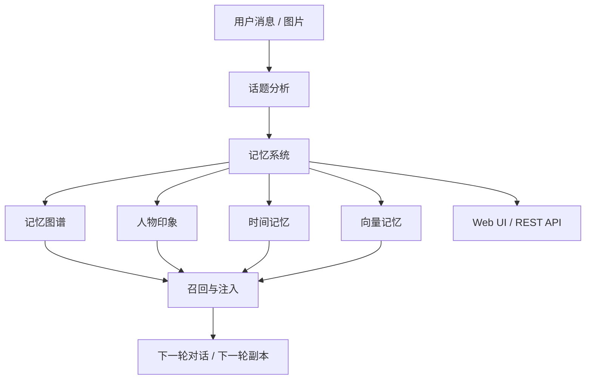

<p align="center">
  <h1 align="center">Infinite-Genre-Instance-Dungeons</h1>
  <p align="center">
    <strong>让你的“无限流副本”真正记住人、记住事、记住关系</strong><br/>
    A memory system for persistent instance-based narrative experiences
  </p>
  <p align="center">
    
    
    
    
    
  </p>
</p>

---

## 目录

- [这是什么](#这是什么)
- [它能帮你解决什么问题](#它能帮你解决什么问题)
- [你能直接获得什么能力](#你能直接获得什么能力)
- [无限流副本记忆的工作方式](#无限流副本记忆的工作方式)
- [适合哪些场景](#适合哪些场景)
- [快速开始](#快速开始)
- [配置说明](#配置说明)
- [日常使用方式](#日常使用方式)
- [Web 管理界面](#web-管理界面)
- [接口概览](#接口概览)
- [多模态记忆](#多模态记忆)
- [技术架构](#技术架构)
- [项目结构](#项目结构)
- [测试与验证](#测试与验证)
- [使用前须知](#使用前须知)
- [关键文件](#关键文件)

---

## 这是什么

这是一个面向“无限流副本记忆”的记忆系统。

如果你正在做的产品、Bot、互动剧情系统或副本系统，存在下面这些需求：

- 希望系统记住用户经历过什么
- 希望下一次副本能延续上一次的主题和关系
- 希望系统记住人物印象、未完成事件和长期冲突
- 希望图片、参考图、场景图也能进入记忆
- 希望记忆可以查、可以管、可以可视化

这套系统就是为这些需求准备的。

它的核心作用不是“替你写完整剧情”，而是提供一层稳定的 **记忆底座**，让你的上层剧情系统、对话系统或副本生成器不再每次都像重开新档。

---

## 它能帮你解决什么问题

很多“无限流副本”系统真正的问题，不是不会生成剧情，而是 **剧情无法连续**。

常见表现是：

- 用户上一轮做过的选择，下一轮完全失效
- 角色关系没有积累，NPC 永远像第一次见面
- 长期主题不会回流，比如职业焦虑、关系拉扯、执念、恐惧
- 重要图片和视觉线索无法进入记忆
- 副本结束后没有“后劲”，系统不会记住未完成的问题

这套系统会把这些内容沉淀为结构化记忆，并在下一轮调用时重新拿出来。

也就是说，它解决的是：

> **如何让副本有前情、让关系有历史、让剧情有延续。**

---

## 你能直接获得什么能力

### 1. 自动形成记忆

系统会把连续对话整理成会话级记忆，而不是只记一条条零碎聊天。

你可以得到：

- 话题摘要
- 关键词
- 事件记忆
- 情绪信息
- 参与者信息
- 地点、标签、细节

### 2. 记住人物印象和关系变化

系统会为人物建立印象记录，并维护好感度或关系强度。

你可以拿这些信息做：

- NPC 对用户态度变化
- 队友关系演化
- 多轮关系冲突
- 支线角色长期追踪

### 3. 记住“还没结束”的事

系统支持未闭合话题追踪和历史今日扫描。

这意味着：

- 上一轮没解决的问题不会凭空消失
- 某些旧事件可以在未来节点重新触发
- 副本可以出现“回访”“翻旧账”“旧因果复燃”

### 4. 支持多模态记忆

除了文本，系统还支持图片进入记忆链路。

你可以用它记住：

- 用户头像或角色参考图
- 场景参考图
- 关键事件截图
- 风格参考图

### 5. 自动召回并注入上下文

当系统进入下一轮对话或剧情生成时，它可以自动召回相关记忆并注入上下文。

这意味着你的上层生成器可以直接吃到：

- 最近高强度记忆
- 当前关系状态
- 近期活跃主题
- 未闭合线程
- 历史关联事件

### 6. 可视化、可管理、可修正

系统内置 Web 管理界面和图谱可视化能力。

你可以：

- 查看记忆状态
- 搜索某条记忆
- 删除错误记忆
- 管理概念、连接和人物印象
- 直接查看记忆图谱

---

## 无限流副本记忆的工作方式

这套系统的工作流很简单：

```text
用户消息 / 图片
→ 系统识别当前话题
→ 形成结构化记忆
→ 存入记忆图谱
→ 建立人物印象 / 时间线 / 关系线
→ 在下一轮对话或副本开始前召回
→ 注入到新的剧情上下文中
```

如果把它放进“无限流副本”里，你可以把它理解成一层海马体：

- 负责记住
- 负责关联
- 负责回想
- 负责保留重点、遗忘琐碎

这样下一轮副本就不再是“重新生成一个新故事”，而是“在已有生命线基础上继续展开”。

---

## 适合哪些场景

这套系统适合：

- 无限流副本系统
- 多周目互动剧情
- 长期陪伴型角色系统
- 关系驱动型 NPC 系统
- 世界线持续推进的聊天叙事产品
- 需要参考图和视觉记忆的剧情系统

如果你的产品更关心“连续体验”而不是“一次性文案生成”，这套系统就很合适。

---

## 快速开始

### 运行前提

- Python 3.10+
- 一个可接入的宿主对话环境
- 一个可用的 LLM 模型服务
- 如果启用 `embedding` 模式，需要可用的嵌入模型服务
- 如果启用多模态，需要额外安装 CLIP / LanceDB 依赖

### 1. 安装基础依赖

```bash
pip install -r requirements.txt
```

### 2. 安装开发依赖

```bash
pip install -r requirements-dev.txt
```

### 3. 安装多模态依赖

```bash
pip install -r requirements-multimodal.txt
```

如果你的环境没有 `transformers`、`torch`、`Pillow` 等多模态依赖，需要一并安装。

### 4. 接入运行环境

主入口文件是：

- [main.py](./main.py)

配置定义见：

- [_conf_schema.json](./_conf_schema.json)

元数据见：

- [metadata.yaml](./metadata.yaml)

### 5. 最小可用配置

推荐先用纯文本模式跑通：

```json
{
  "enable_memory_system": true,
  "enable_group_isolation": true,
  "recall_mode": "simple",
  "enable_enhanced_memory": true,
  "enable_forgetting": true,
  "enable_consolidation": true,
  "llm_provider": "openai",
  "embedding_provider": "openai",
  "topic_trigger_interval_minutes": 5,
  "topic_message_threshold": 12,
  "recent_completed_sessions_count": 5
}
```

### 6. 启用多模态的最小配置

```json
{
  "enable_multimodal": true,
  "lancedb_path": "data/lancedb",
  "clip_model": "openai/clip-vit-base-patch32",
  "multimodal_text_weight": 0.5
}
```

---

## 配置说明

### 核心开关

| 配置项 | 作用 | 推荐值 |
|------|------|------|
| `enable_memory_system` | 记忆总开关 | `true` |
| `enable_group_isolation` | 作用域隔离，避免世界线串线 | `true` |
| `recall_mode` | `simple` / `llm` / `embedding` | 先 `simple`，稳定后切 `embedding` |
| `enable_enhanced_memory` | 增强召回与注入 | `true` |
| `enable_persona_injection_in_memory_generation` | 记忆生成时注入人格约束 | `true` |

### 记忆生命周期

| 配置项 | 作用 |
|------|------|
| `forget_threshold_days` | 多少天后开始计算遗忘 |
| `consolidation_interval_hours` | 多久整理一次记忆 |
| `max_memories_per_topic` | 单主题最多保留多少条记忆 |
| `enable_forgetting` | 是否启用遗忘 |
| `enable_consolidation` | 是否启用整理 |
| `bimodal_recall` | 是否启用双峰时间回忆 |

### 召回与注入

| 配置项 | 作用 |
|------|------|
| `max_injected_memories` | 单次最多注入多少条记忆 |
| `memory_injection_threshold` | 低于该阈值的记忆不注入 |
| `recall_trigger_probability` | 对话过程中触发回忆的概率 |

### 话题分析

| 配置项 | 作用 |
|------|------|
| `topic_trigger_interval_minutes` | 超过多久触发一次分析 |
| `topic_message_threshold` | 积累多少条消息后触发分析 |
| `recent_completed_sessions_count` | 保留多少个最近完成会话摘要 |

### 多模态

| 配置项 | 作用 |
|------|------|
| `enable_multimodal` | 启用图文记忆 |
| `lancedb_path` | 向量库目录 |
| `clip_model` | CLIP 模型名称 |
| `multimodal_text_weight` | 融合向量中文字权重 |

### Web UI

| 配置项 | 作用 |
|------|------|
| `web_ui.enabled` | 启用管理界面 |
| `web_ui.host` | 监听地址 |
| `web_ui.port` | 监听端口 |
| `web_ui.access_token` | API 访问令牌 |

---

## 日常使用方式

### 1. 正常聊天即可形成记忆

系统启动后，消息会自动进入话题缓冲区。  
达到时间或数量阈值后，系统会自动分析并沉淀记忆。

### 2. 用命令直接查记忆

当前支持的命令包括：

- `记忆 回忆 <关键词>`
- `记忆 删除 <memory_id>`
- `记忆 状态`
- `记忆 印象 <人物名>`
- `记忆 图谱 [layout_style]`

### 3. 推荐的副本工作流

如果你要把它接进无限流副本系统，推荐这样使用：

1. 让用户先完成一轮正常互动或副本流程。
2. 系统自动沉淀记忆、人物印象和话题摘要。
3. 在下一轮副本开始前，拉取：
   - 最近高强度记忆
   - 当前人物关系
   - 未闭合问题
   - 近期活跃话题
   - 历史触发事件
4. 把这些结果交给你的上层剧情生成器。
5. 让新的副本围绕旧主题延展，而不是重新开档。

---

## Web 管理界面

启用配置：

```json
{
  "web_ui": {
    "enabled": true,
    "host": "127.0.0.1",
    "port": 6180,
    "access_token": "your-token"
  }
}
```

启动后可访问：

```text
http://127.0.0.1:6180
```

你可以在 Web 界面中完成：

- 查看运行状态
- 切换不同作用域
- 查看图谱 JSON
- 管理概念
- 管理记忆
- 管理连接
- 查询人物印象

如果设置了 `access_token`，访问 `/api/*` 时需要在 Header 中带上：

```text
x-access-token: your-token
```

---

## 接口概览

当前 Web API 包括：

| 方法 | 路径 | 作用 |
|------|------|------|
| `GET` | `/api/status` | 查看运行状态 |
| `GET` | `/api/groups` | 获取可用作用域 |
| `GET` | `/api/graph` | 获取图谱数据 |
| `GET/POST/PUT/DELETE` | `/api/concepts` | 概念管理 |
| `GET/POST/PUT/DELETE` | `/api/memories` | 记忆查询与管理 |
| `GET/POST/PUT/DELETE` | `/api/connections` | 连接管理 |
| `GET/POST/PUT` | `/api/impressions` | 印象查询与维护 |

如果你是把它当成上层副本系统的记忆后端来用，优先建议直接复用：

- [api/gateway.py](./api/gateway.py)
- [core/memory_system.py](./core/memory_system.py)

---

## 多模态记忆

### 你可以记住什么

- 用户本人或角色参考图
- 副本场景图
- 关键剧情截图
- 风格参考图

### 当前支持什么

- 从消息中抽取图片 URL
- CLIP 编码文本和图片
- 合成图文融合向量
- 写入 LanceDB
- 执行跨模态搜索

### 它有什么用

这会让你的副本系统不仅记住“说过什么”，还记住“看过什么”。

对于视觉型剧情系统，这很重要，因为很多主题、情绪和场景其实是图像驱动的，而不是纯文本驱动的。

### 迁移脚本

已有文本记忆迁移到多模态索引时，可以使用：

- [scripts/migrate_to_multimodal.py](./scripts/migrate_to_multimodal.py)

---

## 技术架构

### 总体流程



### 核心模块

| 模块 | 作用 |
|------|------|
| `main.py` | 运行时入口 |
| `core/*` | 记忆核心逻辑 |
| `intelligence/*` | 话题分析、画像、时间记忆 |
| `memory/*` | 召回、展示、可视化 |
| `infrastructure/*` | 数据库、迁移、嵌入、多模态基础设施 |
| `web/*` | Web 管理界面与接口 |
| `api/*` | 内部 API 网关 |

---

## 项目结构

```text
Infinite-Genre-Instance-Dungeons/
├── main.py
├── core/
├── intelligence/
├── memory/
├── infrastructure/
├── api/
├── web/
├── docs/
├── scripts/
├── tests/
├── _conf_schema.json
├── metadata.yaml
└── requirements*.txt
```

详细设计文档见：

- [docs/无限流副本生成：关键词联想驱动的连续剧情系统.md](./docs/无限流副本生成：关键词联想驱动的连续剧情系统.md)
- [docs/无限流副本参考图融合生图方案.md](./docs/无限流副本参考图融合生图方案.md)

---

## 测试与验证

推荐先验证下面几件事：

1. 系统能成功初始化 SQLite。
2. 发送若干消息后能形成记忆。
3. `记忆 状态` 能看到统计结果。
4. `记忆 回忆` 能查到历史条目。
5. 新一轮请求能拿到注入上下文。
6. 开启多模态后，图片能进入 LanceDB。

可直接运行：

```bash
pytest
```

如果要单独跑多模态链路：

```bash
python -m tests.test_multimodal_e2e
```

---

## 使用前须知

### 1. 这套系统负责“记忆”，不是完整副本编排

它最强的部分是：

- 记住
- 关联
- 召回
- 注入

如果你需要五章副本结构、状态机推进、结局分支，这些仍应由上层副本系统完成。

### 2. 推荐先从纯文本模式开始

建议顺序：

1. `simple`
2. `embedding`
3. `enable_multimodal`

这样更容易排障。

### 3. 强烈建议开启作用域隔离

如果你的不同房间、不同群、不同副本世界线不能互相串线，请务必开启：

```json
{
  "enable_group_isolation": true
}
```

### 4. 多模态能力会提高环境复杂度

启用图片记忆后，会额外引入模型、向量库和图片处理链路，部署成本会更高，但效果也会明显更强。

---

## 关键文件

- [main.py](./main.py)：运行时入口
- [core/memory_system.py](./core/memory_system.py)：记忆系统主逻辑
- [core/memory_graph.py](./core/memory_graph.py)：记忆图谱
- [intelligence/topic_analyzer.py](./intelligence/topic_analyzer.py)：话题驱动记忆形成
- [intelligence/temporal.py](./intelligence/temporal.py)：时间维度记忆
- [memory/memory_recall.py](./memory/memory_recall.py)：增强召回
- [web/server.py](./web/server.py)：Web 管理界面
- [api/gateway.py](./api/gateway.py)：内部 API 网关
- [scripts/migrate_to_multimodal.py](./scripts/migrate_to_multimodal.py)：多模态迁移脚本

---

## 总结

如果你希望你的无限流副本系统：

- 不再每次都像第一次见面
- 能记住人物关系和长期主题
- 能保留旧冲突、旧因果和旧情绪
- 能把图片也作为剧情资产记住

这套系统就是为这件事服务的。  
它不是一次性文案生成器，而是一层真正让剧情“有记性”的基础设施。
